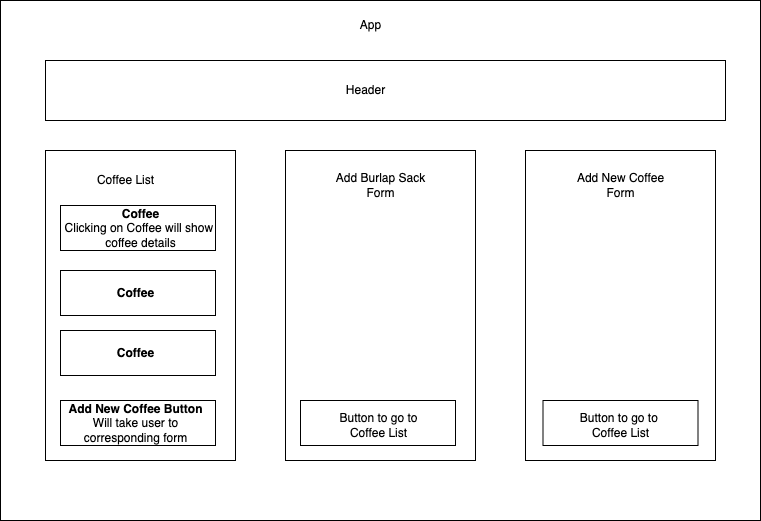

# Central Perk

#### By Richelle Thorpe 

#### This application will allow the user to track coffee inventory for a fictional coffee shop. 

## Technologies Used

- React
- Markdown
- JSX

## Description

- This application will allow the user to view coffee inventory of a fictional coffee shop called Central Perk. The user will be able to add bulk coffee in burlap sacks that will udpdate coffee inventory in pounds. The user will also be able to deplete inventory. 

## Setup/Installation Requirements

1. Clone repository to desired location on your computer.
2. Navigate to project directory central-perk.
3. Install all dependancies with `npm install`.
4. Run program with `npm start`.

## Component Tree Diagram

## Known Bugs

- No known bugs.

## License

Copyright 2023 Richelle Thorpe; Permission is hereby granted, free of charge, to any person obtaining a copy of this software and associated documentation files (the "Software"), to deal in the Software without restriction, including without limitation the rights to use, copy, modify, merge, publish, distribute, sublicense, and/or sell copies of the Software, and to permit persons to whom the Software is furnished to do so, subject to the following conditions: The above copyright notice and this permission notice shall be included in all copies or substantial portions of the Software. THE SOFTWARE IS PROVIDED "AS IS", WITHOUT WARRANTY OF ANY KIND, EXPRESS OR IMPLIED, INCLUDING BUT NOT LIMITED TO THE WARRANTIES OF MERCHANTABILITY, FITNESS FOR A PARTICULAR PURPOSE AND NONINFRINGEMENT. IN NO EVENT SHALL THE AUTHORS OR COPYRIGHT HOLDERS BE LIABLE FOR ANY CLAIM, DAMAGES OR OTHER LIABILITY, WHETHER IN AN ACTION OF CONTRACT, TORT OR OTHERWISE, ARISING FROM, OUT OF OR IN CONNECTION WITH THE SOFTWARE OR THE USE OR OTHER DEALINGS IN THE SOFTWARE.